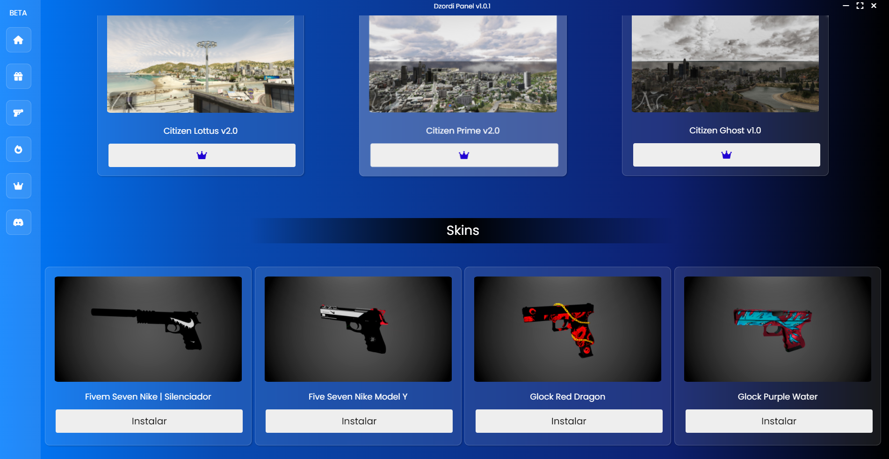

# Dzordi Panel

[](https://github.com/dzordi-community/dzordi-panel)
[](LICENSE)
[](https://www.electronjs.org/)

Painel profissional de gerenciamento de mods para FiveM com autenticação Discord. Instale, gerencie e desinstale mods gráficos e skins de armas para FiveM com facilidade.



---

## 📋 Índice

- [Funcionalidades](#-funcionalidades)
- [Requisitos](#-requisitos)
- [Instalação](#-instalação)
- [Configuração](#️-configuração)
- [Uso](#-uso)
- [Arquitetura](#-arquitetura)
- [Desenvolvimento](#-desenvolvimento)
- [Estrutura do Projeto](#-estrutura-do-projeto)
- [Contribuindo](#-contribuindo)
- [Segurança](#-segurança)
- [Suporte](#-suporte)
- [Licença](#-licença)

---

## 🚀 Funcionalidades

### Autenticação e Segurança
- **Discord OAuth2**: Sistema de login seguro integrado com Discord
- **Controle de Acesso**: Verificação automática de cargos do servidor Discord
- **Persistência de Sessão**: Token armazenado localmente com electron-store

### Gerenciamento de Mods
- **Citizens (Gráficos)**: 5 versões gratuitas + 6 versões VIP premium
- **Skins de Armas**: 6 skins gratuitas + 6 skins VIP premium
- **Instalação/Desinstalação**: Sistema inteligente com detecção de estado
- **Backup Automático**: Restauração de arquivos originais do FiveM

### Interface do Usuário
- **Design Moderno**: Interface com efeitos glassmorphism e animações suaves
- **Carrossel de Imagens**: Visualização prévia de variações dos mods ao passar o mouse
- **Controles Personalizados**: Janela sem moldura com botões customizados
- **Navegação Intuitiva**: Barra lateral com acesso rápido às seções
- **Responsivo**: Adaptável a diferentes resoluções

### Ferramentas Adicionais
- **Limpeza de Cache**: Remove cache do FiveM com um clique
- **Restauração de Citizen**: Volta aos arquivos originais do FiveM
- **Estado Persistente**: Lembra quais mods estão instalados

---

## 💻 Requisitos

- **Sistema Operacional**: Windows 10/11
- **Node.js**: Versão 14 ou superior
- **FiveM**: Instalado no local padrão (`%LOCALAPPDATA%\FiveM\FiveM.app\`)
- **Conta Discord**: Para autenticação
- **Espaço em Disco**: Mínimo 500MB livres

---

## 📦 Instalação

### Instalação Rápida

```bash
git clone https://github.com/dzordi-community/dzordi-panel.git
cd dzordi-panel
npm install
npm start
```

### Instalação Detalhada

1. **Clone o repositório**
   ```bash
   git clone https://github.com/dzordi-community/dzordi-panel.git
   cd dzordi-panel
   ```

2. **Instale as dependências**
   ```bash
   npm install
   ```

3. **Adicione os arquivos de mods**
   - Coloque os arquivos `.rpf` em `public/mods/`
   - Arquivos necessários: `freemode1.rpf` a `freemode5.rpf` e `skin1.rpf` a `skin6.rpf`

4. **Inicie a aplicação**
   ```bash
   npm start
   ```

### Compilar para Distribuição

```bash
npm run package-win
```

O executável será gerado em `dist/`

---

## ⚙️ Configuração

### Modo Desenvolvedor

Para testar sem autenticação Discord, edite `src/shared/constants/index.js`:

```javascript
const APP = {
  NAME: 'Dzordi Panel',
  VERSION: '1.0.1',
  SERVER_PORT: 3000,
  DEV_MODE: true  // true = pula autenticação, false = requer login
};
```

### OAuth do Discord (Opcional)

Para usar sua própria aplicação Discord:

1. Acesse [Portal de Desenvolvedores do Discord](https://discord.com/developers/applications)
2. Crie uma nova aplicação
3. Configure OAuth2:
   - **URI de Redirecionamento**: `http://localhost:3000/callback`
   - **Escopos**: `identify`, `guilds`, `guilds.members.read`
4. Copie as credenciais
5. Edite `src/shared/constants/index.js`:

```javascript
const DISCORD = {
  CLIENT_ID: 'seu_client_id',
  CLIENT_SECRET: 'seu_client_secret',
  BOT_TOKEN: 'seu_bot_token',
  GUILD_ID: 'id_do_seu_servidor',
  REQUIRED_ROLES: ['id_cargo_1', 'id_cargo_2']
};
```

### Configuração de Caminhos

Se o FiveM estiver em local diferente do padrão, edite `src/shared/constants/index.js`:

```javascript
const FIVEM_PATHS = {
  BASE: path.join('C:', 'SeuCaminho', 'FiveM', 'FiveM.app'),
  // ...
};
```

---

## 🎮 Uso

### Primeira Execução

1. **Login**: Clique no botão Discord para autenticar (ou ative DEV_MODE)
2. **Autorização**: Permita o acesso no navegador
3. **Aguarde**: Carregamento automático da aplicação

### Instalando Mods

#### Citizens (Gráficos)
1. Navegue até a seção **Citizens**
2. Escolha o citizen desejado
3. Clique em **Instalar**
4. Aguarde a confirmação
5. **Importante**: Apenas um citizen pode estar ativo por vez

#### Skins de Armas
1. Navegue até a seção **Skins**
2. Escolha a skin desejada
3. Clique em **Instalar**
4. Várias skins podem ser instaladas simultaneamente

### Desinstalando Mods

- Clique em **Desinstalar** no mod instalado
- O botão muda de vermelho/amarelo para branco quando desinstalado

### Ferramentas de Manutenção

#### Limpar Cache do FiveM
1. Vá para **Tweaks**
2. Clique em **Limpar** no card "Clean FiveM Cache"
3. Remove: `nui-storage`, `cache`, `server-cache`, `server-cache-priv`

#### Restaurar Citizen Original
1. Vá para **Tweaks**
2. Clique em **Resetar** no card "Reset to Original Citizen"
3. Restaura os arquivos originais do FiveM

### Controles da Janela

- **Minimizar**: Botão `-` (canto superior direito)
- **Maximizar**: Botão `□` (canto superior direito)
- **Fechar**: Botão `×` (canto superior direito)

---

## 🏗️ Arquitetura

### Visão Geral

O projeto utiliza uma arquitetura limpa e modular baseada em padrões de design profissionais:

```
┌─────────────────────────────────────────────────────────┐
│              Processo Principal (Node.js)                │
│  ┌──────────────┐  ┌──────────────┐  ┌──────────────┐  │
│  │   Serviços   │  │   Janelas    │  │ Configuração │  │
│  │ ─────────────│  │ ─────────────│  │ ─────────────│  │
│  │ AuthService  │  │WindowFactory │  │  AppConfig   │  │
│  │ ModService   │  │WindowManager │  │  Constants   │  │
│  │CacheService  │  └──────────────┘  └──────────────┘  │
│  │ServerService │                                       │
│  └──────────────┘                                       │
└─────────────────────────────────────────────────────────┘
                            │
                  Comunicação IPC
                            │
┌─────────────────────────────────────────────────────────┐
│           Processo Renderizador (Navegador)              │
│  ┌──────────────┐  ┌──────────────┐  ┌──────────────┐  │
│  │ Componentes  │  │   Serviços   │  │ Utilitários  │  │
│  │ ─────────────│  │ ─────────────│  │ ─────────────│  │
│  │ModInstaller  │  │ ModManager   │  │ButtonHandler │  │
│  │              │  │ IPCService   │  │ImageCarousel │  │
│  │              │  │              │  │WindowControls│  │
│  └──────────────┘  └──────────────┘  └──────────────┘  │
└─────────────────────────────────────────────────────────┘
```

### Padrões de Design

#### Padrão Factory (Criação de Janelas)
```javascript
class WindowFactory {
  static createWindow(type, options) {
    return new BrowserWindow(config);
  }
}
```

#### Padrão Service Layer (Lógica de Negócio)
```javascript
class AuthService {
  async fetchUserInfo(token) { }
  async exchangeCodeForToken(code) { }
  hasRequiredRole() { }
}
```

#### Padrão Singleton (Configuração)
```javascript
class AppConfig {
  constructor() { this.config = {}; }
}
module.exports = new AppConfig();
```

#### Padrão Component (UI Modular)
```javascript
class ModInstallerComponent {
  initializeModButton(modId, modFile) { }
  async handleModToggle(modId) { }
}
```

---

## 🔧 Desenvolvimento

### Estrutura de Diretórios

```
dzordi-panel/
├── src/
│   ├── main/                      # Processo Principal
│   │   ├── config/
│   │   │   └── app.config.js      # Configuração da aplicação
│   │   ├── services/              # Serviços de negócio
│   │   │   ├── auth.service.js    # Autenticação Discord
│   │   │   ├── mod.service.js     # Gerenciamento de mods
│   │   │   ├── cache.service.js   # Limpeza de cache
│   │   │   └── server.service.js  # Servidor OAuth
│   │   ├── windows/               # Gerenciamento de janelas
│   │   │   ├── window.factory.js  # Factory de janelas
│   │   │   └── window.manager.js  # Ciclo de vida das janelas
│   │   └── main.js                # Ponto de entrada
│   │
│   ├── renderer/                  # Processo Renderizador
│   │   ├── components/
│   │   │   └── mod-installer.component.js
│   │   ├── pages/                 # Páginas HTML
│   │   │   ├── index.html
│   │   │   ├── login.html
│   │   │   ├── loading.html
│   │   │   ├── renderer.js
│   │   │   └── login-renderer.js
│   │   ├── services/
│   │   │   ├── ipc.service.js
│   │   │   └── mod-manager.service.js
│   │   └── utils/                 # Utilitários
│   │       ├── button-handler.util.js
│   │       ├── image-carousel.util.js
│   │       ├── window-controls.util.js
│   │       └── external-links.util.js
│   │
│   └── shared/                    # Código compartilhado
│       └── constants/
│           └── index.js           # Constantes centralizadas
│
├── public/                        # Assets estáticos
│   ├── assets/                    # Imagens e ícones
│   ├── mods/                      # Arquivos .rpf dos mods
│   └── styles/                    # CSS
│
├── package.json
├── .gitignore
├── LICENSE
└── README.md
```

### Tecnologias Utilizadas

| Tecnologia | Versão | Uso |
|-----------|--------|-----|
| Electron | 13.1.6 | Framework desktop |
| Node.js | 14+ | Runtime backend |
| Express | 4.18.2 | Servidor OAuth |
| Discord OAuth2 | v10 | Autenticação |
| electron-store | 8.1.0 | Persistência de dados |
| fs-extra | 10.0.0 | Operações de arquivo |

### Padrões de Código

#### Nomenclatura
- **Classes**: PascalCase (`AuthService`, `WindowFactory`)
- **Funções**: camelCase (`fetchUserInfo`, `createWindow`)
- **Constantes**: UPPER_SNAKE_CASE (`DISCORD_CLIENT_ID`)
- **Arquivos**:
  - Serviços: `*.service.js`
  - Componentes: `*.component.js`
  - Utilitários: `*.util.js`
  - Configuração: `*.config.js`

#### Princípios
- **Sem comentários**: Código auto-explicativo
- **DRY**: Não repetir código
- **SOLID**: Princípios de design orientado a objetos
- **Responsabilidade única**: Cada módulo tem uma função clara

### Comandos Úteis

```bash
npm start              # Inicia em modo desenvolvimento
npm run package        # Cria build para todas as plataformas
npm run package-win    # Cria build apenas para Windows
npm install            # Instala dependências
```

### Depuração

1. Abra as Ferramentas de Desenvolvedor: `Ctrl + Shift + I`
2. Console: Visualize logs e erros
3. Network: Monitore chamadas de API
4. Application: Inspecione o localStorage

---

## 📁 Estrutura do Projeto

### Processo Principal (`src/main/`)

Responsável pelo ciclo de vida da aplicação, operações do sistema e gerenciamento de janelas.

**Serviços Principais**:
- `AuthService`: Autenticação e gerenciamento de tokens
- `ModService`: Instalação/desinstalação de mods
- `CacheService`: Operações de cache do FiveM
- `ServerService`: Servidor Express para callbacks OAuth

**Gerenciamento de Janelas**:
- `WindowFactory`: Cria janelas com configurações consistentes
- `WindowManager`: Gerencia ciclo de vida e estados das janelas

### Processo Renderizador (`src/renderer/`)

Gerencia a interface do usuário e interações.

**Componentes**:
- `ModInstallerComponent`: Lógica de instalação de mods

**Utilitários**:
- `ButtonHandler`: Gerenciamento de estados de botões
- `ImageCarousel`: Carrossel de imagens
- `WindowControls`: Controles da janela
- `ExternalLinks`: Links externos

### Compartilhado (`src/shared/`)

Código compartilhado entre principal e renderizador.

**Constants**: Todas as constantes da aplicação centralizadas

---

## 🤝 Contribuindo

### Como Contribuir

1. **Faça um Fork** do repositório
2. **Clone** seu fork
   ```bash
   git clone https://github.com/seu-usuario/dzordi-panel.git
   ```
3. **Crie uma branch** para sua funcionalidade
   ```bash
   git checkout -b feature/minha-feature
   ```
4. **Faça suas alterações** seguindo os padrões do projeto
5. **Teste** suas alterações
6. **Commit** suas mudanças
   ```bash
   git commit -m "feat: adiciona nova funcionalidade"
   ```
7. **Push** para seu fork
   ```bash
   git push origin feature/minha-feature
   ```
8. Abra um **Pull Request**

### Padrões de Commit

Use [Conventional Commits](https://www.conventionalcommits.org/):

- `feat:` Nova funcionalidade
- `fix:` Correção de bug
- `docs:` Documentação
- `style:` Formatação (sem mudança de código)
- `refactor:` Refatoração de código
- `test:` Testes
- `chore:` Manutenção

### Diretrizes de Código

- ✅ Código auto-explicativo (sem comentários)
- ✅ Nomenclatura clara e descritiva
- ✅ Um arquivo, uma responsabilidade
- ✅ Teste suas mudanças
- ✅ Atualize documentação se necessário

### Adicionando Novos Mods

1. Adicione o arquivo `.rpf` em `public/mods/`
2. Adicione entrada em `src/shared/constants/index.js`:
   ```javascript
   MODS: {
     FREEMODES: [
       { id: 'freemode6', name: 'Novo Mod', file: 'freemode6.rpf' }
     ]
   }
   ```
3. Adicione UI em `src/renderer/pages/index.html`
4. Inicialize botão em `src/renderer/pages/renderer.js`

---

## 🔒 Segurança

### ⚠️ Avisos Importantes

**Credenciais Fixas no Código**: O código contém credenciais fixas em `src/shared/constants/index.js`:
- Discord Client ID
- Discord Client Secret  
- Discord Bot Token

### 🛡️ Recomendações de Segurança

Para uso em produção:

1. **Use Variáveis de Ambiente**
   ```javascript
   const DISCORD = {
     CLIENT_ID: process.env.DISCORD_CLIENT_ID,
     CLIENT_SECRET: process.env.DISCORD_CLIENT_SECRET,
     BOT_TOKEN: process.env.DISCORD_BOT_TOKEN
   };
   ```

2. **Crie arquivo `.env`**
   ```env
   DISCORD_CLIENT_ID=seu_client_id
   DISCORD_CLIENT_SECRET=seu_client_secret
   DISCORD_BOT_TOKEN=seu_bot_token
   ```

3. **Use dotenv**
   ```bash
   npm install dotenv
   ```
   ```javascript
   require('dotenv').config();
   ```

4. **Nunca faça commit de credenciais**
   - Adicione `.env` no `.gitignore`
   - Revogue tokens expostos
   - Use rotação de secrets

### Isolamento de Contexto

Para maior segurança, habilite o isolamento de contexto:

```javascript
webPreferences: {
  nodeIntegration: false,
  contextIsolation: true,
  preload: path.join(__dirname, 'preload.js')
}
```

---

## 💬 Suporte

### Comunidade

- **Discord**: [discord.gg/EbxB748zPF](https://discord.gg/EbxB748zPF)
  - Canal de suporte
  - Anúncios de atualizações
  - Discussões da comunidade
  
- **YouTube**: [Dzordi Community](https://www.youtube.com/channel/DzordiCommunity)
  - Tutoriais em vídeo
  - Demonstrações de funcionalidades
  - Atualizações

### Problemas e Sugestões

- **Relatar Bugs**: [GitHub Issues](https://github.com/dzordi-community/dzordi-panel/issues)
- **Solicitar Funcionalidades**: Use o template de feature request

### Perguntas Frequentes

**P: O mod não está funcionando no servidor**  
R: Alguns servidores bloqueiam mods. Verifique as regras do servidor.

**P: Como desinstalar todos os mods?**  
R: Use "Reset to Original Citizen" e desinstale as skins manualmente.

**P: Posso ter múltiplos citizens instalados?**  
R: Não, apenas um citizen pode estar ativo por vez.

**P: As skins funcionam em todos os servidores?**  
R: Skins são client-side, mas alguns servidores podem ter proteções.

---

## 📄 Licença

Este projeto está licenciado sob a Licença MIT - veja o arquivo [LICENSE](LICENSE) para detalhes.

### Licença MIT

```
Copyright (c) 2023 Dzordi Community

É concedida permissão, gratuitamente, a qualquer pessoa que obtenha uma cópia
deste software e arquivos de documentação associados (o "Software"), para lidar
no Software sem restrições, incluindo, sem limitação, os direitos de usar,
copiar, modificar, mesclar, publicar, distribuir, sublicenciar e/ou vender
cópias do Software, e permitir que as pessoas a quem o Software é fornecido
o façam, sob as seguintes condições:

O aviso de copyright acima e este aviso de permissão devem ser incluídos em todas
as cópias ou partes substanciais do Software.

O SOFTWARE É FORNECIDO "COMO ESTÁ", SEM GARANTIA DE QUALQUER TIPO, EXPRESSA OU
IMPLÍCITA, INCLUINDO, MAS NÃO SE LIMITANDO ÀS GARANTIAS DE COMERCIALIZAÇÃO,
ADEQUAÇÃO A UM DETERMINADO FIM E NÃO VIOLAÇÃO.
```

---

## 🙏 Créditos

### Desenvolvedores

- **Victor Ferreira** - Contribuidor principal
- **Gabriel Menezes** - Desenvolvimento
- **Prestes.zz** - Desenvolvimento

### Comunidade

Agradecimentos especiais a todos os membros da comunidade Dzordi que ajudaram no desenvolvimento e teste da aplicação.

---

## ⚠️ Aviso Legal

Este software modifica arquivos do FiveM. Use por sua conta e risco.

**Importante**:
- Os desenvolvedores não são responsáveis por problemas decorrentes do uso
- Sempre faça backup da sua instalação do FiveM antes de instalar mods
- Verifique as regras do servidor antes de usar mods
- Alguns servidores podem banir o uso de modificações client-side

---

## 📊 Informações da Versão

**Versão Atual**: 1.0.1  
**Data de Lançamento**: Outubro 2025  
**Status**: Estável

### Histórico de Mudanças

**v1.0.1** - Refatoração Completa
- Implementação de arquitetura profissional
- Adição de padrões de design (Factory, Singleton, Service Layer)
- Modularização completa do código
- Centralização de constantes e configurações
- Melhoria na organização de arquivos
- Documentação completa
- Modo de desenvolvimento sem autenticação

**v1.0.0** - Lançamento Inicial
- Sistema de autenticação Discord
- Instalação/desinstalação de mods
- Interface moderna com glassmorphism
- Gerenciamento de cache
- Restauração de citizen original

---

<div align="center">

**Desenvolvido por Isaac Mello**

[Discord](https://discord.gg/EbxB748zPF) • [YouTube](https://www.youtube.com/channel/DzordiCommunity) • [GitHub](https://github.com/dzordi-community)

</div>
